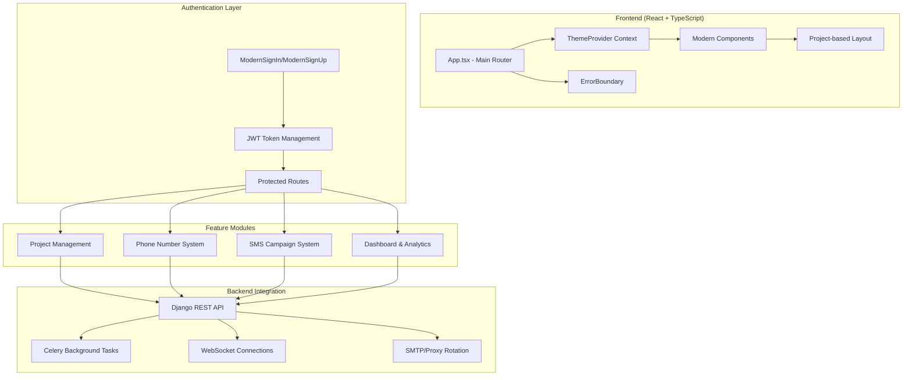

# Design Document

## Overview

The God Bless platform frontend rebuild focuses on fixing critical React errors and ensuring seamless integration with the existing Django backend. The platform already has a comprehensive modern React architecture with TypeScript, theme management, project-based organization, and extensive SMS/phone number management features. This design addresses specific issues while preserving and enhancing the existing implementation.

## Architecture

### Current Architecture Analysis

The platform uses a well-structured architecture:



### Key Architectural Strengths

1. **Modern React 18 Setup**: Proper hooks, context, and component structure
2. **TypeScript Integration**: Strong typing throughout the application
3. **Theme System**: Dark/light mode with persistence
4. **Error Boundaries**: Comprehensive error handling
5. **Lazy Loading**: Performance optimization with code splitting
6. **Project-based Organization**: Modular project management system

## Components and Interfaces

### Core Application Structure

#### App Component Enhancement
```typescript
// Current structure is solid, focus on fixing hook initialization
interface AppState {
  loading: boolean;
  user: User | null;
  theme: Theme;
}

// Ensure proper hook order and conditional rendering
const App: React.FC = () => {
  const [loading, setLoading] = useState<boolean>(true);
  // Fix: Ensure hooks are always called in the same order
  // Fix: Add proper error boundaries around lazy components
}
```

#### Authentication System
```typescript
// Existing ModernSignIn/ModernSignUp are well-implemented
interface AuthenticationProps {
  onSuccess: (user: User) => void;
  onError: (error: string) => void;
}

// Fix: Ensure proper token management and redirect handling
// Fix: Verify localStorage access and error handling
```

### Project Management System

#### Project Components Structure
```typescript
// Existing components: AddProject, AllProjects, ProjectDashboard
interface Project {
  id: string;
  name: string;
  description: string;
  created_at: string;
  updated_at: string;
  user_id: string;
}

// Fix: Ensure proper CRUD operations and state management
// Fix: Verify project routing and layout integration
```

### Phone Number Management

#### Generation and Validation System
```typescript
// Existing components: GenerateNumbersPage, ValidateNumbersPage, AllNumbersPage
interface PhoneNumberGeneration {
  area_code: string;
  quantity: number; // Support up to 1M
  auto_validate: boolean;
  progress: number;
  status: 'pending' | 'running' | 'completed' | 'failed';
}

interface PhoneNumber {
  id: string;
  number: string;
  carrier: string;
  type: string;
  is_valid: boolean;
  validation_date: string;
}

// Fix: Ensure proper background task integration
// Fix: Verify progress tracking and real-time updates
```

### SMS Campaign System

#### Messaging Components
```typescript
// Existing components: SmsSender, BulkSmsSender, CampaignBuilder
interface SMSCampaign {
  id: string;
  name: string;
  message_template: string;
  recipients: PhoneNumber[];
  external_numbers: string[];
  status: 'draft' | 'scheduled' | 'sending' | 'completed';
  smtp_rotation: boolean;
  proxy_rotation: boolean;
}

// Fix: Ensure proper SMTP/proxy rotation integration
// Fix: Verify bulk sending with progress tracking
```

### Dashboard and Real-time Updates

#### Dashboard Components
```typescript
// Existing component: ModernDashboard
interface DashboardData {
  recent_activities: Activity[];
  running_tasks: Task[];
  system_status: SystemStatus;
  project_stats: ProjectStats;
}

// Fix: Ensure proper data fetching and real-time updates
// Fix: Verify WebSocket integration for live updates
```

## Data Models

### User Management
```typescript
interface User {
  id: string;
  email: string;
  username: string;
  photo?: string;
  theme_preference: 'light' | 'dark';
  created_at: string;
}

interface AuthTokens {
  access: string;
  refresh: string;
  expires_at: string;
}
```

### Task Management
```typescript
interface Task {
  id: string;
  type: 'phone_generation' | 'phone_validation' | 'sms_sending' | 'data_export';
  status: 'pending' | 'running' | 'completed' | 'failed';
  progress: number;
  total_items: number;
  processed_items: number;
  created_at: string;
  completed_at?: string;
  error_message?: string;
}
```

### Configuration Management
```typescript
interface SMTPConfig {
  id: string;
  host: string;
  port: number;
  username: string;
  password: string;
  use_tls: boolean;
  is_active: boolean;
}

interface ProxyConfig {
  id: string;
  host: string;
  port: number;
  username?: string;
  password?: string;
  is_active: boolean;
}
```

## Error Handling

### React Error Resolution Strategy

#### Hook Initialization Issues
```typescript
// Problem: "Cannot read properties of null (reading 'useState')"
// Solution: Ensure proper component mounting and hook order

const ComponentWithHooks: React.FC = () => {
  // Fix: Always call hooks at the top level
  const [state, setState] = useState(initialValue);
  
  // Fix: Add proper loading states
  if (!state) {
    return <LoadingSpinner />;
  }
  
  // Fix: Ensure proper error boundaries
  return (
    <ErrorBoundary>
      {/* Component content */}
    </ErrorBoundary>
  );
};
```

#### Context Provider Issues
```typescript
// Fix: Ensure ThemeProvider wraps all components properly
// Fix: Add fallback values for context consumers
const useTheme = () => {
  const context = useContext(ThemeContext);
  if (!context) {
    throw new Error('useTheme must be used within ThemeProvider');
  }
  return context;
};
```

### API Error Handling
```typescript
interface APIError {
  message: string;
  code: string;
  details?: Record<string, any>;
}

// Standardized error handling across all API calls
const handleAPIError = (error: APIError) => {
  toast.error(error.message);
  console.error('API Error:', error);
  // Log to backend error tracking
};
```

## Testing Strategy

### Component Testing Focus
```typescript
// Test critical components that might have hook issues
describe('App Component', () => {
  test('renders without crashing', () => {
    render(<App />);
  });
  
  test('initializes hooks properly', () => {
    const { getByTestId } = render(<App />);
    expect(getByTestId('app-container')).toBeInTheDocument();
  });
});

// Test authentication flow
describe('Authentication', () => {
  test('login flow works correctly', async () => {
    // Test ModernSignIn component
  });
  
  test('registration flow works correctly', async () => {
    // Test ModernSignUp component
  });
});
```

### Integration Testing
```typescript
// Test critical user flows
describe('User Flows', () => {
  test('complete phone number generation flow', async () => {
    // Test generation -> validation -> export flow
  });
  
  test('complete SMS campaign flow', async () => {
    // Test campaign creation -> sending -> monitoring flow
  });
});
```

## Performance Optimization

### React Performance
```typescript
// Optimize re-renders with proper memoization
const MemoizedComponent = React.memo(({ data }) => {
  return <div>{data}</div>;
});

// Use proper dependency arrays in useEffect
useEffect(() => {
  fetchData();
}, [dependency]); // Fix: Ensure proper dependencies
```

### Background Task Integration
```typescript
// Ensure proper Celery task integration
interface TaskManager {
  startTask: (taskType: string, params: any) => Promise<string>;
  getTaskStatus: (taskId: string) => Promise<Task>;
  cancelTask: (taskId: string) => Promise<void>;
}

// WebSocket integration for real-time updates
class WebSocketManager {
  connect(taskId: string): void;
  onProgress(callback: (progress: number) => void): void;
  onComplete(callback: (result: any) => void): void;
  onError(callback: (error: string) => void): void;
}
```

## Security Enhancements

### Token Management
```typescript
// Secure token storage and refresh
class AuthManager {
  private refreshToken(): Promise<AuthTokens>;
  private isTokenExpired(token: string): boolean;
  private clearTokens(): void;
  
  // Automatic token refresh
  async makeAuthenticatedRequest(url: string, options: RequestInit) {
    if (this.isTokenExpired(this.getToken())) {
      await this.refreshToken();
    }
    return fetch(url, {
      ...options,
      headers: {
        ...options.headers,
        Authorization: `Bearer ${this.getToken()}`,
      },
    });
  }
}
```

### Input Validation
```typescript
// Client-side validation for all forms
const validatePhoneNumber = (number: string): boolean => {
  return /^\+?[1-9]\d{1,14}$/.test(number);
};

const validateEmail = (email: string): boolean => {
  return /^[^\s@]+@[^\s@]+\.[^\s@]+$/.test(email);
};
```

## Deployment Architecture

### Environment Configuration
```typescript
// Environment-specific configurations
interface Config {
  API_URL: string;
  WS_URL: string;
  ENVIRONMENT: 'development' | 'production';
  DEBUG: boolean;
}

const config: Config = {
  API_URL: import.meta.env.VITE_API_URL || 'http://localhost:6161',
  WS_URL: import.meta.env.VITE_WS_URL || 'ws://localhost:6161',
  ENVIRONMENT: import.meta.env.VITE_ENVIRONMENT || 'development',
  DEBUG: import.meta.env.VITE_DEBUG === 'true',
};
```

### Build Optimization
```typescript
// Vite configuration for optimal builds
export default defineConfig({
  plugins: [react()],
  build: {
    rollupOptions: {
      output: {
        manualChunks: {
          vendor: ['react', 'react-dom'],
          router: ['react-router-dom'],
          ui: ['react-icons', 'react-hot-toast'],
        },
      },
    },
  },
  server: {
    proxy: {
      '/api': 'http://localhost:6161',
      '/ws': {
        target: 'ws://localhost:6161',
        ws: true,
      },
    },
  },
});
```

## Implementation Priority

### Phase 1: Critical Fixes
1. Resolve React hook initialization errors
2. Fix authentication flow issues
3. Ensure proper error boundary implementation
4. Verify theme context functionality

### Phase 2: Core Features
1. Validate project management CRUD operations
2. Test phone number generation and validation
3. Verify SMS sending functionality
4. Ensure data export works properly

### Phase 3: Advanced Features
1. Implement proper SMTP/proxy rotation
2. Enhance WebSocket real-time updates
3. Optimize Celery task integration
4. Improve error handling and user feedback

### Phase 4: Polish and Optimization
1. Performance optimization
2. Enhanced error messages
3. Improved user experience
4. Comprehensive testing