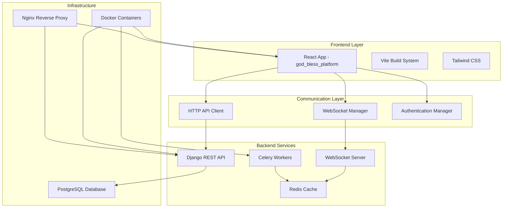

# Design Document

## Overview

The God Bless Platform frontend rebuild will create a modern, reliable React application that replaces the existing problematic frontend while maintaining full compatibility with the Django backend. The new platform will be built using React 18, TypeScript, Vite, and Tailwind CSS, providing a clean architecture that properly integrates with WebSockets, Celery tasks, and the existing API endpoints.

The design emphasizes simplicity, reliability, and maintainability while delivering all required features through a responsive, accessible user interface. The platform will be containerized and integrated into the existing Docker infrastructure with its own dedicated port.

## Architecture

### High-Level Architecture



### Technology Stack

- **Frontend Framework**: React 18 with TypeScript
- **Build Tool**: Vite 4 for fast development and optimized builds
- **Styling**: Tailwind CSS 3 for utility-first styling
- **State Management**: React hooks and Context API (no external state library)
- **HTTP Client**: Custom API client with error handling and authentication
- **WebSocket**: Native WebSocket with automatic reconnection
- **Testing**: Vitest with React Testing Library
- **Containerization**: Docker with multi-stage builds

### Project Structure

```
god_bless_platform/
├── public/
│   ├── index.html
│   └── favicon.ico
├── src/
│   ├── components/          # Reusable UI components
│   │   ├── common/         # Generic components (Button, Modal, etc.)
│   │   ├── forms/          # Form-specific components
│   │   ├── charts/         # Data visualization components
│   │   └── layout/         # Layout components (Header, Sidebar)
│   ├── pages/              # Page components
│   │   ├── auth/           # Authentication pages
│   │   ├── dashboard/      # Dashboard and analytics
│   │   ├── projects/       # Project management
│   │   ├── phone-numbers/  # Phone number operations
│   │   └── sms/            # SMS campaign management
│   ├── hooks/              # Custom React hooks
│   ├── services/           # API and WebSocket services
│   ├── utils/              # Utility functions
│   ├── types/              # TypeScript type definitions
│   ├── contexts/           # React contexts
│   └── styles/             # Global styles and Tailwind config
├── docker/
│   ├── Dockerfile
│   └── nginx.conf
├── tests/
└── config files (vite.config.ts, tailwind.config.js, etc.)
```

## Components and Interfaces

### Core Components

#### 1. Authentication System
- **LoginForm**: Handles user authentication with validation
- **RegisterForm**: User registration with email verification
- **ProtectedRoute**: Route guard for authenticated users
- **AuthProvider**: Context provider for authentication state

#### 2. Layout Components
- **AppLayout**: Main application layout with sidebar and header
- **Sidebar**: Navigation menu with project context switching
- **Header**: Top navigation with user menu and notifications
- **Breadcrumb**: Navigation breadcrumb trail

#### 3. Dashboard Components
- **DashboardOverview**: Main dashboard with key metrics
- **MetricsCard**: Reusable metric display component
- **ActivityFeed**: Real-time activity updates
- **SystemHealthChart**: System performance visualization
- **TaskProgressMonitor**: Real-time task progress display

#### 4. Project Management
- **ProjectList**: Grid/list view of user projects
- **ProjectForm**: Create/edit project form
- **ProjectCard**: Individual project display component
- **ProjectSelector**: Dropdown for project context switching

#### 5. Phone Number Management
- **NumberGenerator**: Phone number generation interface
- **NumberValidator**: Validation interface with bulk options
- **NumberList**: Paginated display of phone numbers
- **FilterPanel**: Advanced filtering and search
- **ExportDialog**: Multi-format export options

#### 6. SMS Campaign Management
- **CampaignCreator**: SMS campaign composition interface
- **RecipientSelector**: Target audience selection
- **MessageComposer**: Rich text message editor
- **CampaignMonitor**: Real-time campaign progress
- **DeliveryReport**: Campaign results and analytics

### API Service Layer

#### HTTP API Client
```typescript
interface ApiClient {
  // Authentication
  login(credentials: LoginCredentials): Promise<AuthResponse>
  register(userData: RegisterData): Promise<AuthResponse>
  logout(): Promise<void>
  
  // Projects
  getProjects(): Promise<Project[]>
  createProject(project: CreateProjectData): Promise<Project>
  updateProject(id: string, project: UpdateProjectData): Promise<Project>
  deleteProject(id: string): Promise<void>
  
  // Phone Numbers
  generateNumbers(params: GenerateNumbersParams): Promise<TaskResponse>
  validateNumbers(params: ValidateNumbersParams): Promise<TaskResponse>
  getNumbers(filters: NumberFilters): Promise<PaginatedNumbers>
  exportNumbers(params: ExportParams): Promise<ExportResponse>
  
  // SMS Campaigns
  createCampaign(campaign: CreateCampaignData): Promise<Campaign>
  sendSMS(params: SendSMSParams): Promise<TaskResponse>
  getCampaigns(): Promise<Campaign[]>
  getCampaignReport(id: string): Promise<CampaignReport>
  
  // Dashboard
  getDashboardMetrics(): Promise<DashboardMetrics>
  getSystemHealth(): Promise<SystemHealth>
  getTaskHistory(): Promise<Task[]>
}
```

#### WebSocket Manager
```typescript
interface WebSocketManager {
  connect(): void
  disconnect(): void
  subscribe(channel: string, callback: (data: any) => void): void
  unsubscribe(channel: string): void
  
  // Task progress updates
  onTaskProgress(callback: (progress: TaskProgress) => void): void
  onTaskComplete(callback: (result: TaskResult) => void): void
  onTaskError(callback: (error: TaskError) => void): void
  
  // System notifications
  onSystemNotification(callback: (notification: SystemNotification) => void): void
}
```

## Data Models

### Core Types

```typescript
// Authentication
interface User {
  id: string
  email: string
  firstName: string
  lastName: string
  isActive: boolean
  dateJoined: string
}

interface AuthResponse {
  token: string
  user: User
  expiresAt: string
}

// Projects
interface Project {
  id: string
  name: string
  description: string
  status: 'active' | 'inactive' | 'archived'
  priority: 'low' | 'medium' | 'high'
  createdAt: string
  updatedAt: string
  phoneNumberCount: number
  validNumberCount: number
  campaignCount: number
}

// Phone Numbers
interface PhoneNumber {
  id: string
  number: string
  carrier: string
  isValid: boolean
  validatedAt?: string
  country: string
  region: string
  projectId: string
}

// Tasks
interface Task {
  id: string
  type: 'phone_generation' | 'phone_validation' | 'sms_campaign' | 'export'
  status: 'pending' | 'running' | 'completed' | 'failed'
  progress: number
  result?: any
  error?: string
  createdAt: string
  completedAt?: string
  projectId?: string
}

// SMS Campaigns
interface Campaign {
  id: string
  name: string
  message: string
  recipientCount: number
  sentCount: number
  deliveredCount: number
  failedCount: number
  status: 'draft' | 'sending' | 'completed' | 'failed'
  createdAt: string
  projectId: string
}

// Dashboard
interface DashboardMetrics {
  totalProjects: number
  totalPhoneNumbers: number
  validPhoneNumbers: number
  activeTasks: number
  completedTasks24h: number
  systemHealth: SystemHealth
}

interface SystemHealth {
  cpu: {
    usage: number
    status: 'healthy' | 'warning' | 'critical'
  }
  memory: {
    usage: number
    available: number
    status: 'healthy' | 'warning' | 'critical'
  }
  redis: {
    connected: boolean
    status: 'healthy' | 'warning' | 'critical'
  }
}
```

## Error Handling

### Error Handling Strategy

1. **API Errors**: Centralized error handling with user-friendly messages
2. **Network Errors**: Automatic retry with exponential backoff
3. **WebSocket Errors**: Automatic reconnection with connection status display
4. **Validation Errors**: Real-time form validation with clear feedback
5. **Task Errors**: Detailed error reporting with retry options

### Error Types

```typescript
interface ApiError {
  code: string
  message: string
  details?: Record<string, any>
  status: number
}

interface ValidationError {
  field: string
  message: string
  code: string
}

interface TaskError {
  taskId: string
  type: string
  message: string
  details?: any
  retryable: boolean
}
```

### Error Boundaries

- **Global Error Boundary**: Catches unhandled React errors
- **Route Error Boundaries**: Page-level error handling
- **Component Error Boundaries**: Isolated error handling for critical components

## Testing Strategy

### Testing Approach

1. **Unit Tests**: Individual component and utility function testing
2. **Integration Tests**: API integration and user flow testing
3. **E2E Tests**: Critical user journey testing
4. **Visual Regression Tests**: UI consistency testing

### Testing Tools

- **Vitest**: Fast unit testing framework
- **React Testing Library**: Component testing utilities
- **MSW (Mock Service Worker)**: API mocking for tests
- **Playwright**: End-to-end testing (optional)

### Test Coverage Goals

- **Components**: 80% coverage for critical components
- **Services**: 90% coverage for API and WebSocket services
- **Utilities**: 95% coverage for utility functions
- **Integration**: 70% coverage for user flows

### Testing Structure

```
tests/
├── unit/
│   ├── components/
│   ├── hooks/
│   ├── services/
│   └── utils/
├── integration/
│   ├── auth-flow.test.ts
│   ├── project-management.test.ts
│   ├── phone-operations.test.ts
│   └── sms-campaigns.test.ts
├── e2e/
│   ├── user-journey.spec.ts
│   └── critical-paths.spec.ts
└── mocks/
    ├── api/
    ├── websocket/
    └── data/
```

## Performance Considerations

### Optimization Strategies

1. **Code Splitting**: Route-based and component-based lazy loading
2. **Memoization**: React.memo and useMemo for expensive operations
3. **Virtual Scrolling**: For large data lists (phone numbers, tasks)
4. **Debounced Search**: Prevent excessive API calls during search
5. **Caching**: API response caching with invalidation strategies
6. **Bundle Optimization**: Tree shaking and chunk optimization

### Real-time Updates

1. **WebSocket Connection Management**: Single connection with channel multiplexing
2. **Selective Updates**: Only update affected components
3. **Connection Resilience**: Automatic reconnection with exponential backoff
4. **Fallback Polling**: Graceful degradation when WebSocket fails

## Security Considerations

### Authentication & Authorization

1. **Token-based Authentication**: JWT tokens with refresh mechanism
2. **Route Protection**: Authenticated route guards
3. **API Security**: Token validation on all API requests
4. **Session Management**: Secure token storage and automatic logout

### Data Protection

1. **Input Validation**: Client-side validation with server-side verification
2. **XSS Prevention**: Sanitized user inputs and CSP headers
3. **CSRF Protection**: CSRF tokens for state-changing operations
4. **Secure Communication**: HTTPS enforcement and secure WebSocket connections

## Deployment Architecture

### Docker Configuration

The platform will be integrated into the existing Docker infrastructure with the following configuration:

```yaml
# Addition to docker-compose.prod.yml
god_bless_platform:
  build:
    context: ./god_bless_platform
    dockerfile: Dockerfile.prod
    args:
      - VITE_API_URL=${VITE_API_URL:-http://localhost/api}
      - VITE_WS_URL=${VITE_WS_URL:-ws://localhost/ws}
  container_name: god_bless_platform
  ports:
    - "3001:80"  # Dedicated port separate from existing frontend
  restart: unless-stopped
  networks:
    - god_bless_network
  healthcheck:
    test: ["CMD", "wget", "--quiet", "--tries=1", "--spider", "http://localhost:80"]
    interval: 30s
    timeout: 10s
    retries: 3
    start_period: 40s
```

### Environment Configuration

```typescript
// Environment variables
interface EnvironmentConfig {
  VITE_API_URL: string          // Backend API base URL
  VITE_WS_URL: string           // WebSocket server URL
  VITE_APP_NAME: string         // Application name
  VITE_VERSION: string          // Application version
  VITE_ENVIRONMENT: string      // Environment (development/production)
}
```

### Build Process

1. **Development**: Vite dev server with hot module replacement
2. **Production**: Optimized build with static asset generation
3. **Docker**: Multi-stage build with Nginx serving static files
4. **CI/CD**: Automated testing and deployment pipeline

This design provides a solid foundation for building a reliable, maintainable, and scalable frontend that properly integrates with the existing backend infrastructure while avoiding the issues present in the current implementation.