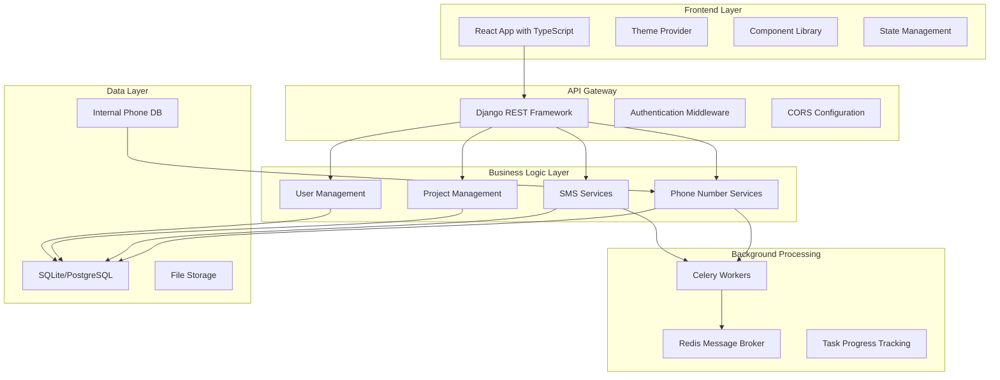

# Design Document

## Overview

The God Bless platform modernization involves a comprehensive overhaul of both frontend and backend systems to create a cohesive, performant, and user-friendly multi-service platform. The design focuses on implementing modern UI/UX patterns, optimizing backend processes with Celery task queues, removing legacy dependencies, and ensuring production-ready deployment capabilities.

## Architecture

### High-Level Architecture



### Technology Stack Enhancements

**Frontend Modernization:**
- Enhanced React 18 with improved TypeScript integration
- Context-based theme management for dark/light modes
- Optimized component architecture with proper prop typing
- Enhanced state management for real-time updates
- Improved routing with protected routes and role-based access

**Backend Optimization:**
- Celery integration for all resource-intensive operations
- WebSocket support for real-time progress updates
- Enhanced API serialization and validation
- Improved error handling and logging
- Database query optimization

## Components and Interfaces

### Frontend Component Architecture

#### Theme System
```typescript
interface ThemeContextType {
  theme: 'light' | 'dark';
  toggleTheme: () => void;
  setTheme: (theme: 'light' | 'dark') => void;
}

interface ThemeProviderProps {
  children: React.ReactNode;
  defaultTheme?: 'light' | 'dark';
}
```

#### Enhanced UI Components
- **DataTable Component**: Advanced filtering, sorting, pagination, and export capabilities
- **ProgressTracker**: Real-time progress indication for background tasks
- **FilterPanel**: Reusable filtering interface for all data views
- **ExportModal**: Multi-format export functionality
- **NotificationCenter**: Centralized notification system
- **LoadingStates**: Skeleton loaders and progress indicators

#### Page Components Redesign
- **Landing Page**: Modern hero section, feature showcase, testimonials
- **Dashboard**: Real-time metrics, system health, task monitoring
- **Authentication**: Streamlined login/register with proper validation
- **Phone Management**: Enhanced generation and validation interfaces
- **SMS Center**: Unified single and bulk SMS management
- **Settings**: Comprehensive configuration management

### Backend API Design

#### Enhanced Endpoints Structure
```
/api/v1/
├── auth/
│   ├── login/
│   ├── register/
│   ├── logout/
│   └── refresh/
├── phone/
│   ├── generate/
│   ├── validate/
│   ├── bulk-validate/
│   └── export/
├── sms/
│   ├── send/
│   ├── bulk-send/
│   ├── schedule/
│   └── status/
├── tasks/
│   ├── status/{task_id}/
│   ├── progress/{task_id}/
│   └── cancel/{task_id}/
└── settings/
    ├── smtp/
    ├── proxy/
    └── preferences/
```

#### Celery Task Architecture
```python
# Task Categories
class TaskCategories:
    PHONE_GENERATION = 'phone_generation'
    PHONE_VALIDATION = 'phone_validation'
    SMS_SENDING = 'sms_sending'
    DATA_EXPORT = 'data_export'
    
# Task Progress Tracking
class TaskProgress:
    task_id: str
    status: TaskStatus
    progress: int  # 0-100
    current_step: str
    total_items: int
    processed_items: int
    estimated_completion: datetime
    result_data: dict
```

## Data Models

### Enhanced User Management
```python
class User(AbstractUser):
    theme_preference = models.CharField(max_length=10, default='light')
    notification_preferences = models.JSONField(default=dict)
    api_rate_limit = models.IntegerField(default=1000)
    last_activity = models.DateTimeField(auto_now=True)
```

### Phone Number Management
```python
class PhoneNumber(models.Model):
    number = models.CharField(max_length=15, unique=True)
    carrier = models.CharField(max_length=50)
    number_type = models.CharField(max_length=20)
    area_code = models.CharField(max_length=5)
    is_valid = models.BooleanField(default=True)
    validation_date = models.DateTimeField(auto_now_add=True)
    created_by = models.ForeignKey(User, on_delete=models.CASCADE)

class PhoneGenerationTask(models.Model):
    user = models.ForeignKey(User, on_delete=models.CASCADE)
    area_code = models.CharField(max_length=5)
    quantity = models.IntegerField()
    status = models.CharField(max_length=20)
    progress = models.IntegerField(default=0)
    created_at = models.DateTimeField(auto_now_add=True)
    completed_at = models.DateTimeField(null=True)
```

### SMS Management
```python
class SMSCampaign(models.Model):
    user = models.ForeignKey(User, on_delete=models.CASCADE)
    name = models.CharField(max_length=100)
    message_template = models.TextField()
    target_carrier = models.CharField(max_length=50, null=True)
    scheduled_time = models.DateTimeField(null=True)
    status = models.CharField(max_length=20)
    
class SMSMessage(models.Model):
    campaign = models.ForeignKey(SMSCampaign, on_delete=models.CASCADE)
    phone_number = models.CharField(max_length=15)
    message_content = models.TextField()
    delivery_status = models.CharField(max_length=20)
    sent_at = models.DateTimeField(null=True)
    delivered_at = models.DateTimeField(null=True)
```

### Configuration Management
```python
class SystemSettings(models.Model):
    user = models.ForeignKey(User, on_delete=models.CASCADE)
    smtp_rotation_enabled = models.BooleanField(default=True)
    proxy_rotation_enabled = models.BooleanField(default=True)
    delivery_delay_min = models.IntegerField(default=1)
    delivery_delay_max = models.IntegerField(default=5)
    batch_size = models.IntegerField(default=100)
```

## Error Handling

### Frontend Error Management
- **Global Error Boundary**: Catch and handle React component errors
- **API Error Interceptor**: Centralized API error handling with user-friendly messages
- **Validation Errors**: Real-time form validation with clear error indicators
- **Network Error Handling**: Offline detection and retry mechanisms

### Backend Error Handling
- **Custom Exception Classes**: Specific exceptions for different error types
- **API Error Responses**: Standardized error response format
- **Task Error Recovery**: Automatic retry mechanisms for failed background tasks
- **Logging Integration**: Comprehensive error logging with context

```python
class APIErrorResponse:
    error_code: str
    message: str
    details: dict
    timestamp: datetime
    request_id: str
```

## Testing Strategy

### Frontend Testing
- **Unit Tests**: Component testing with React Testing Library
- **Integration Tests**: API integration and user flow testing
- **E2E Tests**: Critical user journeys with Playwright
- **Visual Regression**: Screenshot comparison for UI consistency
- **Accessibility Testing**: WCAG compliance verification

### Backend Testing
- **Unit Tests**: Model and utility function testing
- **API Tests**: Endpoint testing with DRF test client
- **Task Tests**: Celery task testing with mock data
- **Performance Tests**: Load testing for high-volume operations
- **Security Tests**: Authentication and authorization testing

### Test Data Management
- **Fixtures**: Consistent test data across environments
- **Factory Pattern**: Dynamic test data generation
- **Database Seeding**: Automated test database setup
- **Mock Services**: External service mocking for isolated testing

## Performance Optimization

### Frontend Optimization
- **Code Splitting**: Route-based and component-based lazy loading
- **Bundle Optimization**: Tree shaking and dead code elimination
- **Caching Strategy**: Browser caching and service worker implementation
- **Image Optimization**: WebP format and responsive images
- **Virtual Scrolling**: Efficient rendering of large data sets

### Backend Optimization
- **Database Optimization**: Query optimization and indexing strategy
- **Caching Layer**: Redis caching for frequently accessed data
- **Background Processing**: Celery task queues for heavy operations
- **API Pagination**: Efficient pagination for large datasets
- **Connection Pooling**: Database connection optimization

### Scalability Considerations
- **Horizontal Scaling**: Container-based scaling with Docker
- **Load Balancing**: Nginx configuration for traffic distribution
- **Database Sharding**: Preparation for database scaling
- **CDN Integration**: Static asset delivery optimization

## Security Enhancements

### Authentication & Authorization
- **JWT Token Management**: Secure token handling with refresh mechanisms
- **Role-Based Access**: Granular permission system
- **Session Security**: Secure session management and timeout handling
- **Password Security**: Strong password requirements and hashing

### Data Protection
- **Input Validation**: Comprehensive input sanitization
- **SQL Injection Prevention**: Parameterized queries and ORM usage
- **XSS Protection**: Content Security Policy implementation
- **CSRF Protection**: Token-based CSRF prevention

### Infrastructure Security
- **HTTPS Enforcement**: SSL/TLS configuration
- **Environment Variables**: Secure configuration management
- **API Rate Limiting**: Request throttling and abuse prevention
- **Audit Logging**: Security event tracking and monitoring

## Deployment Architecture

### Container Strategy
```yaml
# Docker Compose Structure
services:
  frontend:
    build: ./god_bless_frontend
    ports: ["5173:5173"]
    environment:
      - VITE_API_URL=http://backend:6161
      
  backend:
    build: ./god_bless_backend
    ports: ["6161:6161"]
    depends_on: [db, redis]
    
  celery:
    build: ./god_bless_backend
    command: celery -A god_bless_pro worker -l info
    depends_on: [db, redis]
    
  celery-beat:
    build: ./god_bless_backend
    command: celery -A god_bless_pro beat -l info
    depends_on: [db, redis]
    
  db:
    image: postgres:15
    environment:
      POSTGRES_DB: god_bless_db
      
  redis:
    image: redis:7-alpine
```

### Environment Configuration
- **Development**: Docker Compose with hot reloading
- **Production**: Optimized containers with health checks
- **Staging**: Production-like environment for testing
- **Local**: Simplified setup for development

### Monitoring & Logging
- **Application Monitoring**: Health checks and performance metrics
- **Error Tracking**: Centralized error collection and alerting
- **Log Aggregation**: Structured logging with correlation IDs
- **Performance Monitoring**: Response time and throughput tracking