# Authentication Flow Diagram

## Complete User Authentication Journey

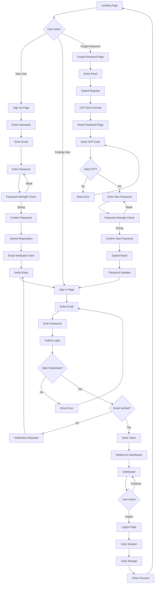

## Sign Up Flow Detail

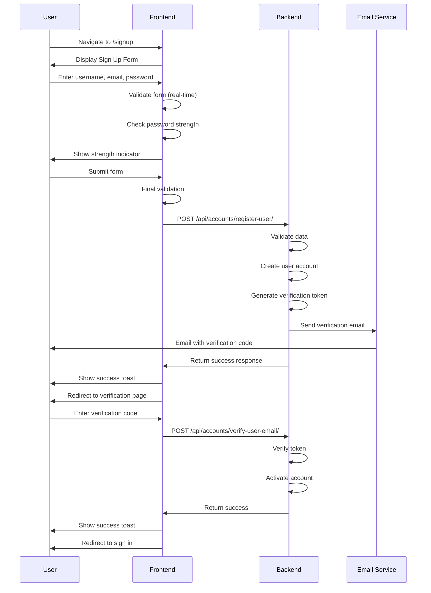

## Sign In Flow Detail

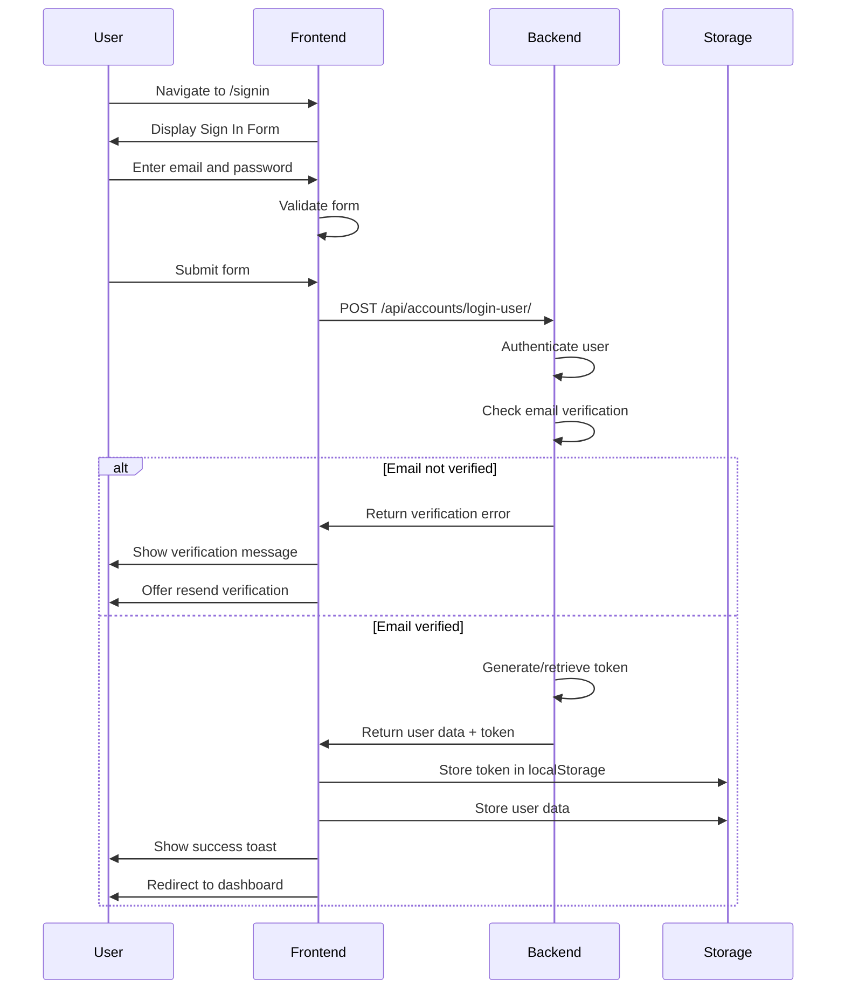

## Password Reset Flow Detail

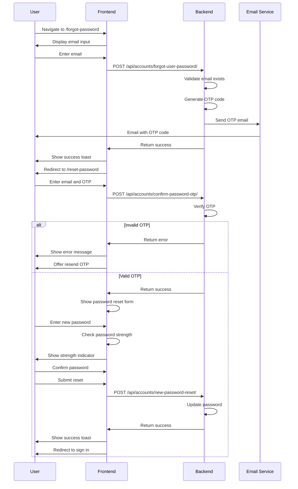

## Logout Flow Detail

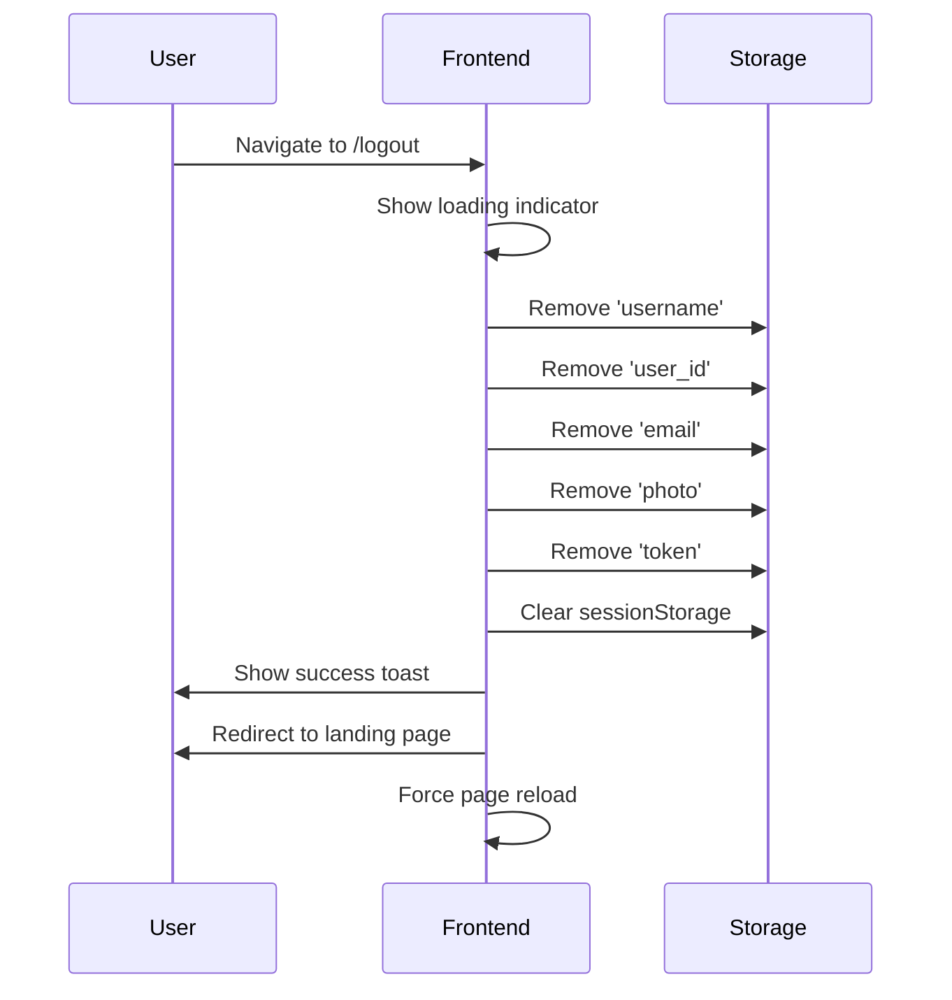

## Session Management

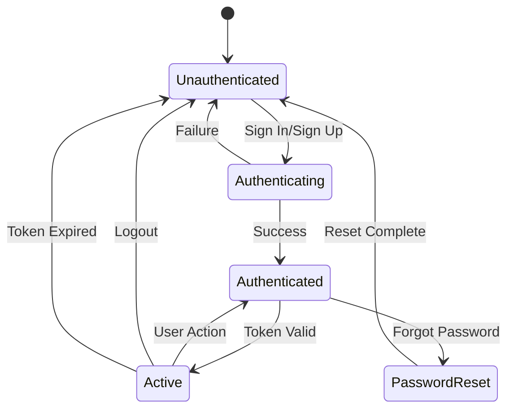

## Password Strength Calculation

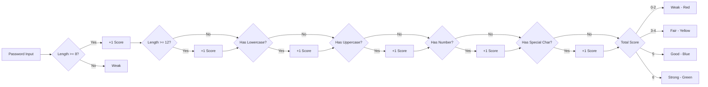

## Form Validation Flow

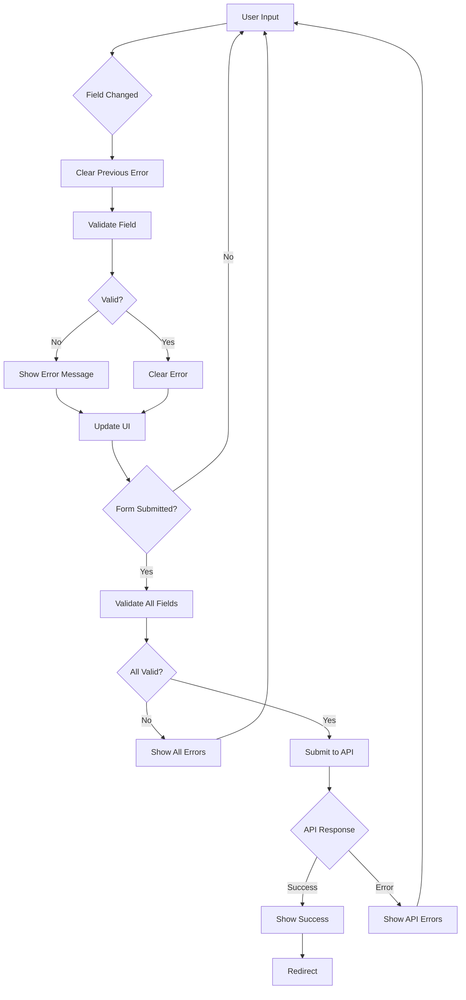

## Error Handling Flow

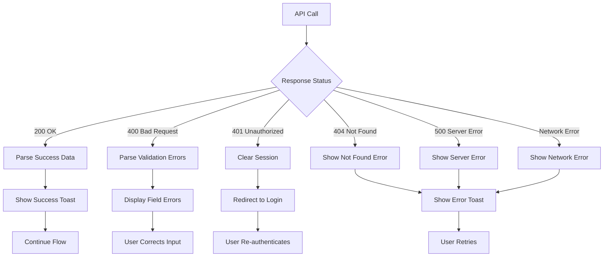

## Component Interaction

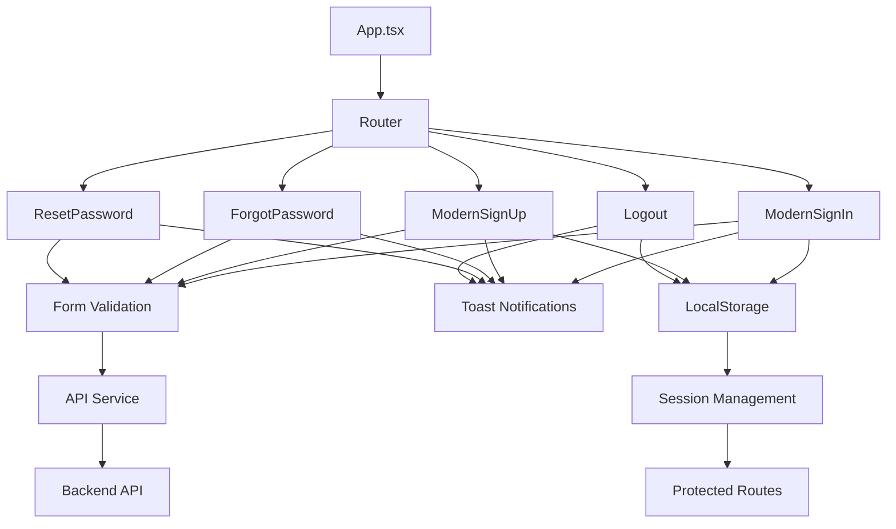

## Data Flow

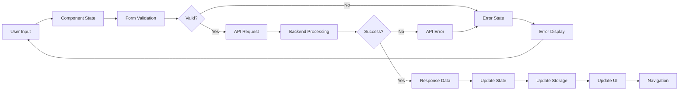

## Security Flow

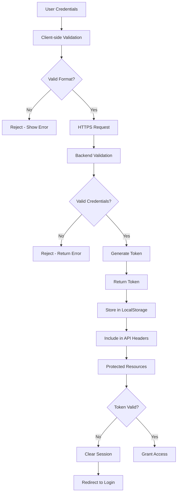

## Key Features by Component

### ModernSignIn
- Email/password input
- Real-time validation
- Password visibility toggle
- Loading states
- Error handling
- Session creation

### ModernSignUp
- Username/email/password input
- Password strength indicator
- Password confirmation
- Real-time validation
- Loading states
- Email verification trigger

### ForgotPassword
- Email input
- OTP request
- Email validation
- Loading states
- Error handling

### ResetPassword
- Two-step process
- OTP verification
- Password reset
- Password strength indicator
- Resend OTP option
- Loading states

### Logout
- Session cleanup
- Storage clearing
- Success notification
- Redirect handling
- Page reload

## State Management

```
Component State:
├── Form Data
│   ├── email
│   ├── password
│   ├── username
│   └── confirmPassword
├── UI State
│   ├── loading
│   ├── showPassword
│   └── step (for multi-step)
├── Validation State
│   ├── errors
│   └── touched
└── Password Strength
    ├── score
    ├── label
    └── color

LocalStorage:
├── token
├── user_id
├── username
├── email
└── photo
```

## Navigation Flow

```
Landing (/) 
    ├── Sign Up (/signup)
    │   └── Verify Email (/verify-user/:email)
    │       └── Sign In (/signin)
    ├── Sign In (/signin)
    │   ├── Dashboard (/dashboard) [on success]
    │   └── Forgot Password (/forgot-password)
    │       └── Reset Password (/reset-password)
    │           └── Sign In (/signin)
    └── Dashboard (/dashboard)
        └── Logout (/logout)
            └── Landing (/)
```

## API Endpoints Summary

| Endpoint | Method | Purpose | Auth Required |
|----------|--------|---------|---------------|
| `/api/accounts/register-user/` | POST | User registration | No |
| `/api/accounts/login-user/` | POST | User login | No |
| `/api/accounts/verify-user-email/` | POST | Email verification | No |
| `/api/accounts/forgot-user-password/` | POST | Request password reset | No |
| `/api/accounts/confirm-password-otp/` | POST | Verify OTP code | No |
| `/api/accounts/resend-password-otp/` | POST | Resend OTP code | No |
| `/api/accounts/new-password-reset/` | POST | Reset password | No |

## Success Criteria Checklist

- ✅ User can register with valid credentials
- ✅ Email verification works
- ✅ User can sign in with correct credentials
- ✅ Invalid credentials are rejected
- ✅ Password strength indicator updates in real-time
- ✅ Password reset flow completes successfully
- ✅ OTP verification works
- ✅ Logout clears all session data
- ✅ Form validation works in real-time
- ✅ Error messages are clear and helpful
- ✅ Loading states are visible during API calls
- ✅ Toast notifications appear for all actions
- ✅ Dark mode works correctly
- ✅ Responsive design works on all devices
- ✅ Keyboard navigation works
- ✅ No console errors
- ✅ Session persists across page reloads
- ✅ Protected routes redirect to login when not authenticated
